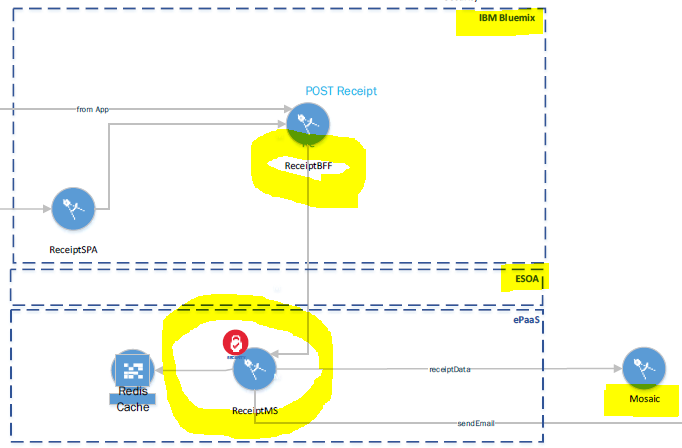

# ReceiptsMS (Self Service Receipts data access microservice)
- ## Background
  ##### This microservice is the key component as a JDBC data access layer to Self Service Receipts data source - Mosaic. And since Mosaic, at this point, resides inside AA enterprise infrastructure, at this writing AA does not provide an easy solution to source JDBC data outside of company network, therefore forcing this microservice to be deployed to AA private cloud - ePaaS.
  #### Specially noted that this microservice also serves Wi-Fi subscriptions receipt requests coming from legacy aa.com.  

- ## High level architecture
  ##### Following is the high level microservices including ReceiptsMS process flow and cloud representation from architecture stand point, 
  1) Firstly, ReceiptsBFF in BMX Cloud Foundry sends requests via eSOA to ReceiptsMS in ePaaS.
  
  2) ReceiptsMS constructs database query by applying request search criteria to where clause and invoking JDBC call with the query to Mosaic. Mosaic sends back the query results which then parsed by ReceiptsMS, and building response json sending back to ReceiptsBFF.

- ## Process flow diagram
   
  
- ## Application configuration files
   - **src/main/resources/application.yml**
   - **src/main/resources/application-prod.yml** 

- ## Running the application locally
  ### - Always connects to Mosaic production for data retrieval
  ### - VPN is needed
  ### - Plug prodFunctonalId and prodFunctonalIdPassword into application.yml temporarily at below locations. Ask other developers for the values.
  - spring.datasource.username: prodFunctonalId
  - spring.datasource.password: prodFunctonalIdPassword
	    
  ##### Open - src\main\java\com\aa\etds\receiptsmailer\ReceiptsMailerApplication.java and run ReceiptsMailerApplication class in appropriate mode (run/debug)

  - #### Important notes while running application locally:-
    - ###### While running application locally, we dont want to update PNR, send email to actual customer and send to error queue. Following steps are needed to achieve this,
      1) pnrUpdateManager.updatePNR and errorQueueClient.queuePlace function call should be commented in
         **src\main\java\com\aa\etds\receiptsmailer\service\impl\ReceiptMailerServiceImpl.java**.
         
      2) Set your email in **src\main\java\com\aa\etds\receiptsmailer\mapper\ReprintMapper.java** file. For example -
         reprint.setEmailAddress("sandesh.neupane@aa.com"), so that your will get email for validation and testing.
         
      3) Install and Open RabbitMQ in web browser (url:- http://localhost:15672/)  and use username and password as follows:-
         username- "guest"
         password- "guest"
         - GoTo Queues tab
         - Click on local-reprint-listener queue (If this queue is not available, re-run ReceiptsMailerMS application and try again.)
         - Add payload in payload section and hit publish message button.

- ## Debugging points
  - **src\main\java\com\aa\etds\receiptsmailer\service\impl\ReceiptMailerServiceImpl.java** will be starting point to debug this application.

- ## Automated Testing

  - #### How to run the unit test suite
    - **mvn test** - command can be used to run unit tests

  - #### How to validate results
    - **mvn validate** - command can be used to, validate the project is correct and all necessary information is available

  - #### How to run integration test
    - We are working to automate integration test. Currently, integration test can be run through CucumberIT class.
      - path: **src\test\java\com\aa\etds\receiptsmailer\integration\test\CucumberIT.java**

- ## Sonarqube
  - Code quality, warnings and test coverage for each files can be found in Sonarqube.
     - link:- https://sonarqube.aa.com/dashboard?id=TR.receipts-mailer-ms
     
- ## Coverity
  - Code quality and security. 
     - link:- https://coverity.aa.com/reports.htm#v10164/p11158

- ## Javadoc
  #### Open apidocs/index.html with Web Browser

  ###### To re-generate Javadoc, 
  - run **'mvn javadoc:javadoc'** locally from project root. Then copy **targer/site/apidocs** to **root/apidocs**,
  - commit all changes in root/apidocs.